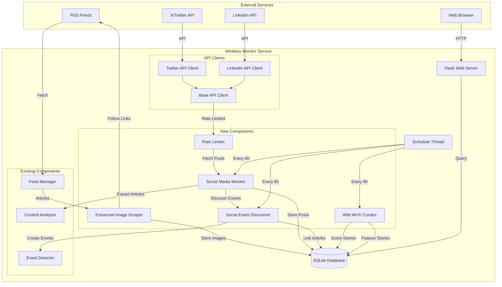
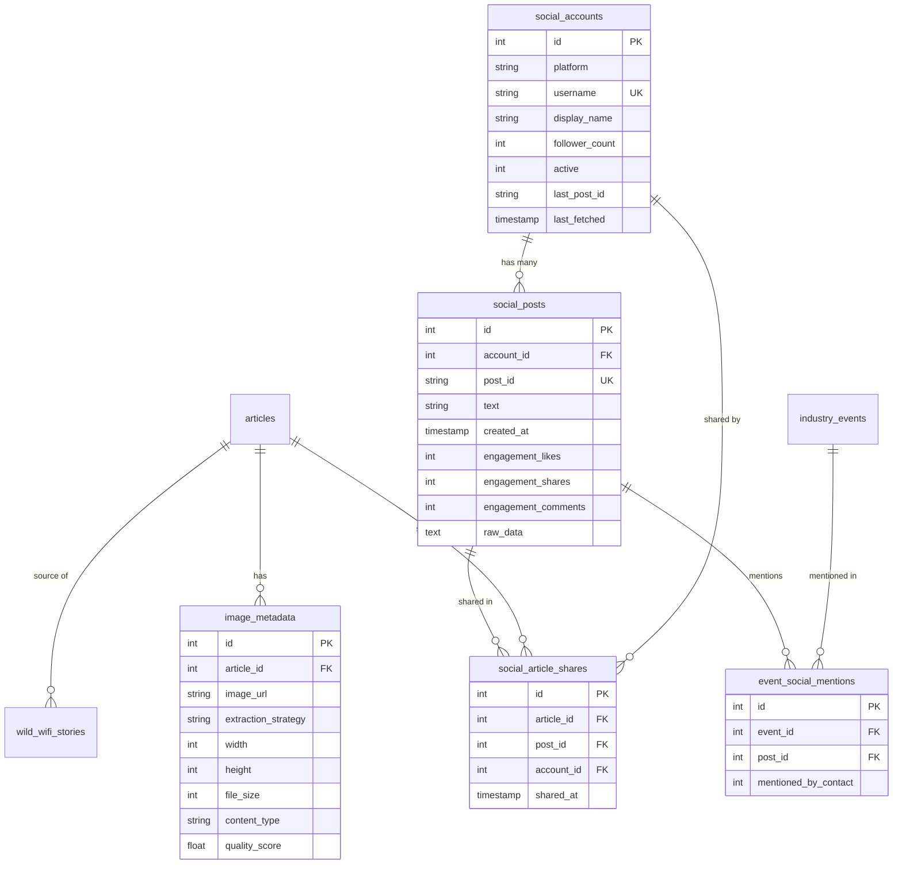
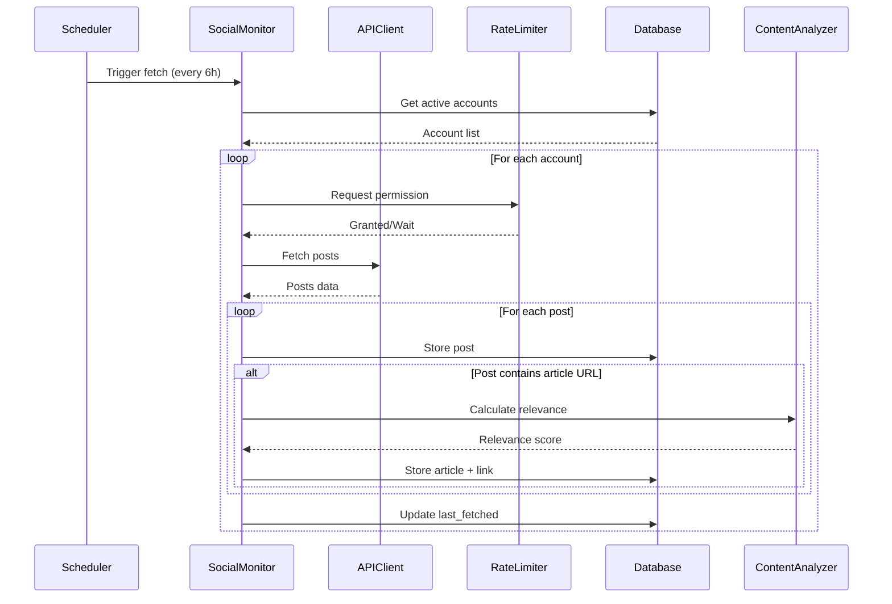
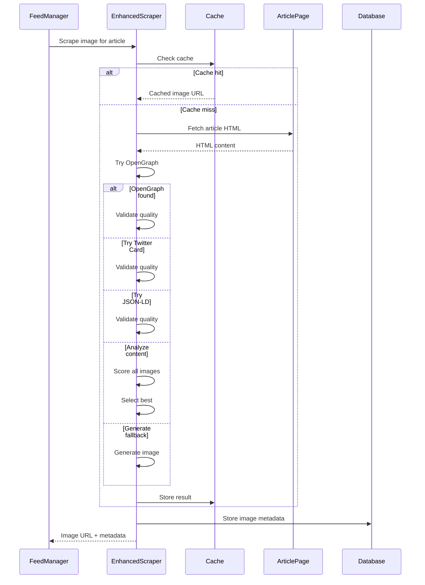

# Design Document: Wireless Monitor Enhancements

## Overview

This document specifies the design for four major enhancements to the existing Wireless Monitor System: enhanced image scraping with multi-strategy extraction, social media account monitoring and content integration, automated Wild Wi-Fi story curation, and social media event discovery. These enhancements integrate with the existing Flask/SQLite architecture while maintaining backward compatibility and system reliability.

### Key Design Principles

- **Integration**: Extend existing components without breaking current functionality
- **Modularity**: New features are self-contained and can be enabled/disabled independently
- **Reliability**: Graceful degradation when social media APIs are unavailable
- **Performance**: Minimal impact on existing RSS feed fetching and article display
- **Security**: Encrypted storage of API credentials and secure API communication
- **Scalability**: Support for adding new social media platforms without major refactoring

### Technology Stack Extensions

**New Dependencies**:
- **tweepy 4.14.0**: X/Twitter API client library
- **linkedin-api 2.2.0**: LinkedIn API client (unofficial)
- **cryptography 41.0.7**: For encrypting API credentials
- **pillow 10.1.0**: Already included, enhanced usage for image validation
- **aiohttp 3.9.1**: Async HTTP client for parallel image scraping
- **textblob 0.17.1**: Natural language processing for humor scoring

**Existing Dependencies** (reused):
- Flask, SQLite, feedparser, BeautifulSoup, requests, schedule

## Architecture

### Enhanced System Architecture




### Component Integration Points

The enhancements integrate with existing components at these points:

1. **Enhanced Image Scraper** → Replaces existing Image_Scraper logic in WirelessMonitor class
2. **Social Media Monitor** → Adds new scheduled task alongside RSS fetching
3. **Content Analyzer** → Reused for scoring social media articles
4. **Event Detector** → Extended to accept events from social media discovery
5. **Database** → Extended with new tables, existing tables remain unchanged
6. **Admin Dashboard** → Extended with new management sections

## Components and Interfaces

### 1. Enhanced Image Scraper

Improved image extraction that follows article links and uses multiple strategies.

**Interface**:
```python
class EnhancedImageScraper:
    def __init__(self, cache_ttl=86400):
        """
        Initialize enhanced image scraper.
        
        Args:
            cache_ttl: Cache time-to-live in seconds (default 24 hours)
        """
        self.cache = {}  # URL -> (image_url, metadata, timestamp)
        self.cache_ttl = cache_ttl
        self.session = aiohttp.ClientSession(timeout=aiohttp.ClientTimeout(total=10))
    
    async def scrape_article_image(self, article_url: str, article_title: str) -> dict:
        """
        Scrape high-quality image from article URL using multiple strategies.
        
        Args:
            article_url: URL of the article
            article_title: Title of the article
        
        Returns:
            Dictionary with:
                - image_url: URL of the image or None
                - strategy: Strategy that succeeded
                - metadata: Image dimensions, file size, content type
                - cached: Whether result was from cache
        
        Strategies (in priority order):
            1. Check cache for recent result
            2. Open Graph metadata (og:image)
            3. Twitter Card metadata (twitter:image)
            4. JSON-LD structured data
            5. Article content analysis (score by size, position, context)
            6. Fallback to existing generation
        """
    
    async def extract_opengraph_image(self, soup: BeautifulSoup, article_url: str) -> dict:
        """Extract image from Open Graph metadata."""
    
    async def extract_twitter_card_image(self, soup: BeautifulSoup, article_url: str) -> dict:
        """Extract image from Twitter Card metadata."""
    
    async def extract_jsonld_image(self, soup: BeautifulSoup, article_url: str) -> dict:
        """Extract image from JSON-LD structured data."""
    
    async def analyze_content_images(self, soup: BeautifulSoup, article_url: str) -> dict:
        """
        Analyze all images in article content and score them.
        
        Scoring factors:
            - Dimensions (prefer 1200x630 or larger)
            - Position in DOM (prefer early in article)
            - Context (prefer images near article title/content)
            - File size (prefer > 50KB)
            - Aspect ratio (prefer 16:9 or 4:3)
        """
    
    async def validate_image_quality(self, image_url: str) -> dict:
        """
        Validate image quality and extract metadata.
        
        Returns:
            Dictionary with:
                - valid: Boolean
                - width: Image width in pixels
                - height: Image height in pixels
                - file_size: File size in bytes
                - content_type: MIME type
                - reason: Rejection reason if invalid
        
        Validation criteria:
            - Dimensions >= 400x300 pixels
            - File size >= 10KB
            - Valid image format (JPEG, PNG, WebP)
            - Not a tracking pixel, icon, or logo
            - Accessible (HTTP 200)
        """
    
    def score_image(self, metadata: dict, position: int, context_score: float) -> float:
        """
        Calculate quality score for an image.
        
        Args:
            metadata: Image metadata from validation
            position: Position in DOM (0 = first)
            context_score: Relevance to article content (0-1)
        
        Returns:
            Quality score (0-100)
        """
```

**Image Scoring Algorithm**:
```
Base score = 0

Dimension score:
  - If width >= 1200 and height >= 630: +30
  - Else if width >= 800 and height >= 600: +20
  - Else if width >= 400 and height >= 300: +10

File size score:
  - If size >= 100KB: +20
  - Else if size >= 50KB: +15
  - Else if size >= 10KB: +10

Position score:
  - If position == 0: +15
  - Else if position <= 2: +10
  - Else if position <= 5: +5

Context score:
  - context_score * 20 (0-20 points)

Aspect ratio score:
  - If ratio between 1.5 and 1.8 (16:9): +15
  - Else if ratio between 1.2 and 1.4 (4:3): +10
  - Else if ratio between 0.9 and 1.1 (square): +5

Total score = sum of all scores (0-100)
```


### 2. Base API Client

Abstract base class for social media platform clients.

**Interface**:
```python
from abc import ABC, abstractmethod
from typing import List, Dict, Optional

class BaseAPIClient(ABC):
    """Base class for social media API clients."""
    
    def __init__(self, credentials: dict, rate_limiter: 'RateLimiter'):
        """
        Initialize API client.
        
        Args:
            credentials: Platform-specific credentials
            rate_limiter: Rate limiter instance
        """
        self.credentials = credentials
        self.rate_limiter = rate_limiter
        self.platform = self.get_platform_name()
    
    @abstractmethod
    def get_platform_name(self) -> str:
        """Return platform name (twitter, linkedin, etc.)."""
    
    @abstractmethod
    async def fetch_user_posts(self, username: str, since_id: Optional[str] = None) -> List[Dict]:
        """
        Fetch posts from a user's timeline.
        
        Args:
            username: Username to fetch posts from
            since_id: Only fetch posts after this ID
        
        Returns:
            List of normalized post dictionaries with:
                - id: Platform-specific post ID
                - text: Post text content
                - created_at: ISO 8601 timestamp
                - author: Username of author
                - urls: List of URLs in post
                - engagement: Dict with likes, shares, comments
                - raw: Original platform-specific data
        """
    
    @abstractmethod
    async def validate_credentials(self) -> bool:
        """Validate API credentials by making a test request."""
    
    @abstractmethod
    async def get_user_info(self, username: str) -> Dict:
        """
        Get user profile information.
        
        Returns:
            Dictionary with:
                - username: Username
                - display_name: Display name
                - follower_count: Number of followers
                - verified: Whether account is verified
        """
    
    def normalize_post(self, raw_post: dict) -> dict:
        """
        Normalize platform-specific post to common format.
        
        This method should be overridden by subclasses to handle
        platform-specific data structures.
        """
        pass
    
    def extract_urls(self, post_text: str, entities: dict) -> List[str]:
        """Extract and expand URLs from post."""
        pass
```

### 3. Twitter API Client

Implementation for X/Twitter API integration.

**Interface**:
```python
import tweepy

class TwitterAPIClient(BaseAPIClient):
    """Twitter/X API client using tweepy."""
    
    def __init__(self, credentials: dict, rate_limiter: 'RateLimiter'):
        """
        Initialize Twitter client.
        
        Credentials required:
            - api_key: Twitter API key
            - api_secret: Twitter API secret
            - access_token: User access token
            - access_token_secret: User access token secret
        """
        super().__init__(credentials, rate_limiter)
        self.client = tweepy.Client(
            bearer_token=credentials.get('bearer_token'),
            consumer_key=credentials['api_key'],
            consumer_secret=credentials['api_secret'],
            access_token=credentials['access_token'],
            access_token_secret=credentials['access_token_secret']
        )
    
    def get_platform_name(self) -> str:
        return "twitter"
    
    async def fetch_user_posts(self, username: str, since_id: Optional[str] = None) -> List[Dict]:
        """
        Fetch tweets from user timeline.
        
        Uses Twitter API v2 user timeline endpoint.
        Rate limit: 900 requests per 15 minutes.
        """
        await self.rate_limiter.acquire(self.platform, 'user_timeline')
        
        try:
            response = self.client.get_users_tweets(
                username=username,
                since_id=since_id,
                max_results=100,
                tweet_fields=['created_at', 'public_metrics', 'entities'],
                expansions=['author_id']
            )
            
            posts = []
            for tweet in response.data or []:
                posts.append(self.normalize_post(tweet))
            
            return posts
        except tweepy.TweepyException as e:
            # Handle rate limit, auth errors, etc.
            raise
    
    def normalize_post(self, tweet) -> dict:
        """Normalize Twitter tweet to common format."""
        return {
            'id': tweet.id,
            'text': tweet.text,
            'created_at': tweet.created_at.isoformat(),
            'author': tweet.author_id,
            'urls': self.extract_urls(tweet.text, tweet.entities),
            'engagement': {
                'likes': tweet.public_metrics['like_count'],
                'retweets': tweet.public_metrics['retweet_count'],
                'replies': tweet.public_metrics['reply_count'],
                'quotes': tweet.public_metrics['quote_count']
            },
            'raw': tweet.data
        }
```

### 4. LinkedIn API Client

Implementation for LinkedIn API integration.

**Interface**:
```python
from linkedin_api import Linkedin

class LinkedInAPIClient(BaseAPIClient):
    """LinkedIn API client."""
    
    def __init__(self, credentials: dict, rate_limiter: 'RateLimiter'):
        """
        Initialize LinkedIn client.
        
        Credentials required:
            - username: LinkedIn username/email
            - password: LinkedIn password
        
        Note: Uses unofficial API via linkedin-api library.
        Official API requires company approval.
        """
        super().__init__(credentials, rate_limiter)
        self.client = Linkedin(
            credentials['username'],
            credentials['password']
        )
    
    def get_platform_name(self) -> str:
        return "linkedin"
    
    async def fetch_user_posts(self, username: str, since_id: Optional[str] = None) -> List[Dict]:
        """
        Fetch posts from LinkedIn profile.
        
        Rate limit: 100 requests per day (conservative).
        """
        await self.rate_limiter.acquire(self.platform, 'profile_posts')
        
        try:
            profile = self.client.get_profile(username)
            posts = self.client.get_profile_posts(profile['public_id'], post_count=50)
            
            normalized_posts = []
            for post in posts:
                # Skip if older than since_id
                if since_id and post['created']['time'] <= int(since_id):
                    continue
                
                normalized_posts.append(self.normalize_post(post))
            
            return normalized_posts
        except Exception as e:
            # Handle auth errors, rate limits, etc.
            raise
    
    def normalize_post(self, post: dict) -> dict:
        """Normalize LinkedIn post to common format."""
        return {
            'id': str(post['created']['time']),
            'text': post.get('commentary', {}).get('text', ''),
            'created_at': datetime.fromtimestamp(post['created']['time'] / 1000).isoformat(),
            'author': post['author']['username'],
            'urls': self.extract_urls_from_linkedin(post),
            'engagement': {
                'likes': post.get('socialDetail', {}).get('totalSocialActivityCounts', {}).get('numLikes', 0),
                'comments': post.get('socialDetail', {}).get('totalSocialActivityCounts', {}).get('numComments', 0),
                'shares': post.get('socialDetail', {}).get('totalSocialActivityCounts', {}).get('numShares', 0)
            },
            'raw': post
        }
```


### 5. Rate Limiter

Manages API request rates to avoid exceeding platform limits.

**Interface**:
```python
import time
from collections import defaultdict
from typing import Dict, Tuple

class RateLimiter:
    """Manages API rate limits for multiple platforms."""
    
    def __init__(self, db_path: str):
        """
        Initialize rate limiter.
        
        Args:
            db_path: Path to SQLite database for persistent state
        """
        self.db_path = db_path
        self.limits = {
            'twitter': {
                'user_timeline': (900, 900),  # (requests, seconds)
                'user_info': (900, 900)
            },
            'linkedin': {
                'profile_posts': (100, 86400),  # 100 per day
                'profile_info': (100, 86400)
            }
        }
        self.state = self.load_state()
    
    def load_state(self) -> Dict:
        """Load rate limit state from database."""
        conn = sqlite3.connect(self.db_path)
        cursor = conn.cursor()
        cursor.execute("""
            SELECT platform, endpoint, request_count, window_start
            FROM rate_limit_state
        """)
        
        state = defaultdict(lambda: defaultdict(lambda: {'count': 0, 'window_start': time.time()}))
        for row in cursor.fetchall():
            platform, endpoint, count, window_start = row
            state[platform][endpoint] = {'count': count, 'window_start': window_start}
        
        conn.close()
        return state
    
    def save_state(self):
        """Save rate limit state to database."""
        conn = sqlite3.connect(self.db_path)
        cursor = conn.cursor()
        
        for platform, endpoints in self.state.items():
            for endpoint, data in endpoints.items():
                cursor.execute("""
                    INSERT OR REPLACE INTO rate_limit_state
                    (platform, endpoint, request_count, window_start, updated_at)
                    VALUES (?, ?, ?, ?, CURRENT_TIMESTAMP)
                """, (platform, endpoint, data['count'], data['window_start']))
        
        conn.commit()
        conn.close()
    
    async def acquire(self, platform: str, endpoint: str):
        """
        Acquire permission to make an API request.
        
        Blocks if rate limit would be exceeded.
        
        Args:
            platform: Platform name (twitter, linkedin)
            endpoint: Endpoint name (user_timeline, profile_posts)
        """
        if platform not in self.limits or endpoint not in self.limits[platform]:
            return  # No limit configured
        
        max_requests, window_seconds = self.limits[platform][endpoint]
        current_state = self.state[platform][endpoint]
        
        # Check if window has expired
        elapsed = time.time() - current_state['window_start']
        if elapsed >= window_seconds:
            # Reset window
            current_state['count'] = 0
            current_state['window_start'] = time.time()
        
        # Check if limit reached
        if current_state['count'] >= max_requests:
            # Calculate wait time
            wait_time = window_seconds - elapsed
            if wait_time > 0:
                print(f"Rate limit reached for {platform}/{endpoint}. Waiting {wait_time:.0f}s...")
                await asyncio.sleep(wait_time)
                # Reset after waiting
                current_state['count'] = 0
                current_state['window_start'] = time.time()
        
        # Increment counter
        current_state['count'] += 1
        self.save_state()
    
    def get_status(self, platform: str, endpoint: str) -> Dict:
        """
        Get current rate limit status.
        
        Returns:
            Dictionary with:
                - remaining: Requests remaining in window
                - reset_time: When window resets (timestamp)
                - percentage_used: Percentage of limit used
        """
        if platform not in self.limits or endpoint not in self.limits[platform]:
            return {'remaining': float('inf'), 'reset_time': None, 'percentage_used': 0}
        
        max_requests, window_seconds = self.limits[platform][endpoint]
        current_state = self.state[platform][endpoint]
        
        elapsed = time.time() - current_state['window_start']
        if elapsed >= window_seconds:
            remaining = max_requests
            reset_time = time.time()
        else:
            remaining = max_requests - current_state['count']
            reset_time = current_state['window_start'] + window_seconds
        
        percentage_used = (current_state['count'] / max_requests) * 100
        
        return {
            'remaining': remaining,
            'reset_time': reset_time,
            'percentage_used': percentage_used
        }
```

### 6. Social Media Monitor

Coordinates social media account monitoring and content extraction.

**Interface**:
```python
class SocialMediaMonitor:
    """Monitors configured social media accounts and extracts content."""
    
    def __init__(self, db_path: str, rate_limiter: RateLimiter):
        """
        Initialize social media monitor.
        
        Args:
            db_path: Path to SQLite database
            rate_limiter: Rate limiter instance
        """
        self.db_path = db_path
        self.rate_limiter = rate_limiter
        self.clients = {}  # platform -> client instance
    
    def initialize_clients(self):
        """Initialize API clients for all configured platforms."""
        conn = sqlite3.connect(self.db_path)
        cursor = conn.cursor()
        
        # Get credentials for each platform
        cursor.execute("""
            SELECT platform, api_key, api_secret, access_token, access_token_secret
            FROM social_config
            WHERE enabled = 1
        """)
        
        for row in cursor.fetchall():
            platform, api_key, api_secret, access_token, access_token_secret = row
            credentials = {
                'api_key': self.decrypt(api_key),
                'api_secret': self.decrypt(api_secret),
                'access_token': self.decrypt(access_token),
                'access_token_secret': self.decrypt(access_token_secret)
            }
            
            if platform == 'twitter':
                self.clients[platform] = TwitterAPIClient(credentials, self.rate_limiter)
            elif platform == 'linkedin':
                self.clients[platform] = LinkedInAPIClient(credentials, self.rate_limiter)
        
        conn.close()
    
    async def fetch_all_accounts(self) -> Dict[str, int]:
        """
        Fetch posts from all active monitored accounts.
        
        Returns:
            Dictionary with statistics:
                - accounts_fetched: Number of accounts processed
                - posts_fetched: Total posts fetched
                - articles_discovered: Articles extracted from posts
                - errors: Number of errors encountered
        """
        stats = {
            'accounts_fetched': 0,
            'posts_fetched': 0,
            'articles_discovered': 0,
            'errors': 0
        }
        
        conn = sqlite3.connect(self.db_path)
        cursor = conn.cursor()
        
        # Get all active accounts
        cursor.execute("""
            SELECT id, platform, username, last_post_id
            FROM social_accounts
            WHERE active = 1
        """)
        
        accounts = cursor.fetchall()
        
        for account_id, platform, username, last_post_id in accounts:
            try:
                if platform not in self.clients:
                    print(f"No client for platform: {platform}")
                    continue
                
                client = self.clients[platform]
                posts = await client.fetch_user_posts(username, since_id=last_post_id)
                
                for post in posts:
                    # Store post
                    post_id = self.store_post(account_id, post)
                    stats['posts_fetched'] += 1
                    
                    # Extract and process article URLs
                    for url in post['urls']:
                        if self.is_article_url(url):
                            article_id = await self.process_article_url(url, post_id, account_id)
                            if article_id:
                                stats['articles_discovered'] += 1
                
                # Update last_post_id
                if posts:
                    latest_post_id = posts[0]['id']
                    cursor.execute("""
                        UPDATE social_accounts
                        SET last_post_id = ?, last_fetched = CURRENT_TIMESTAMP
                        WHERE id = ?
                    """, (latest_post_id, account_id))
                
                stats['accounts_fetched'] += 1
                
            except Exception as e:
                print(f"Error fetching {username} on {platform}: {e}")
                stats['errors'] += 1
        
        conn.commit()
        conn.close()
        
        return stats
    
    def store_post(self, account_id: int, post: dict) -> int:
        """Store social media post in database."""
        conn = sqlite3.connect(self.db_path)
        cursor = conn.cursor()
        
        cursor.execute("""
            INSERT INTO social_posts
            (account_id, post_id, text, created_at, engagement_likes, 
             engagement_shares, engagement_comments, raw_data)
            VALUES (?, ?, ?, ?, ?, ?, ?, ?)
        """, (
            account_id,
            post['id'],
            post['text'],
            post['created_at'],
            post['engagement'].get('likes', 0),
            post['engagement'].get('shares', 0) + post['engagement'].get('retweets', 0),
            post['engagement'].get('comments', 0) + post['engagement'].get('replies', 0),
            json.dumps(post['raw'])
        ))
        
        post_db_id = cursor.lastrowid
        conn.commit()
        conn.close()
        
        return post_db_id
    
    async def process_article_url(self, url: str, post_id: int, account_id: int) -> Optional[int]:
        """
        Process an article URL from a social media post.
        
        Returns:
            Article ID if successfully processed, None otherwise
        """
        # Fetch article content
        # Calculate relevance score
        # Store article
        # Link to social post
        pass
    
    def is_article_url(self, url: str) -> bool:
        """Check if URL is likely an article (not social media, images, etc.)."""
        excluded_domains = ['twitter.com', 'x.com', 'linkedin.com', 'facebook.com',
                           'instagram.com', 'youtube.com', 'youtu.be']
        excluded_extensions = ['.jpg', '.png', '.gif', '.mp4', '.pdf']
        
        for domain in excluded_domains:
            if domain in url:
                return False
        
        for ext in excluded_extensions:
            if url.endswith(ext):
                return False
        
        return True
```


### 7. Wild Wi-Fi Curator

Automatically scores and features Wild Wi-Fi stories.

**Interface**:
```python
from textblob import TextBlob

class WildWiFiCurator:
    """Curates Wild Wi-Fi stories with automatic scoring and featuring."""
    
    def __init__(self, db_path: str):
        """
        Initialize curator.
        
        Args:
            db_path: Path to SQLite database
        """
        self.db_path = db_path
        self.humor_indicators = [
            'unexpected', 'ironically', 'surprisingly', 'accidentally',
            'somehow', 'turns out', 'believe it or not', 'absurd',
            'ridiculous', 'hilarious', 'bizarre', 'strange'
        ]
        self.tech_keywords = [
            'wifi', 'wi-fi', 'wireless', 'router', 'signal', 'network',
            'internet', 'connection', 'bandwidth', 'ssid', 'password'
        ]
    
    def calculate_humor_score(self, story_text: str) -> float:
        """
        Calculate humor score for a story.
        
        Args:
            story_text: Story text content
        
        Returns:
            Humor score (0-10)
        
        Algorithm:
            1. Count humor indicators (0-3 points)
            2. Analyze sentiment for surprise/unexpectedness (0-3 points)
            3. Check for specific/concrete details (0-2 points)
            4. Check for irony/contrast (0-2 points)
        """
        score = 0.0
        text_lower = story_text.lower()
        
        # Humor indicators (max 3 points)
        indicator_count = sum(1 for indicator in self.humor_indicators if indicator in text_lower)
        score += min(indicator_count * 1.0, 3.0)
        
        # Sentiment analysis for unexpectedness (max 3 points)
        blob = TextBlob(story_text)
        # Look for sentiment shifts or extreme polarity
        if abs(blob.sentiment.polarity) > 0.5:
            score += 2.0
        if blob.sentiment.subjectivity > 0.6:
            score += 1.0
        
        # Specific details (max 2 points)
        # Check for numbers, locations, specific names
        has_numbers = any(char.isdigit() for char in story_text)
        has_quotes = '"' in story_text or "'" in story_text
        if has_numbers:
            score += 1.0
        if has_quotes:
            score += 1.0
        
        # Irony/contrast (max 2 points)
        # Look for contrasting words
        contrast_words = ['but', 'however', 'instead', 'although', 'despite']
        contrast_count = sum(1 for word in contrast_words if word in text_lower)
        score += min(contrast_count * 0.5, 2.0)
        
        return min(score, 10.0)
    
    def calculate_tech_relevance_score(self, story_text: str, tech_relevance: str) -> float:
        """
        Calculate technical relevance score.
        
        Args:
            story_text: Story text
            tech_relevance: Tech relevance explanation
        
        Returns:
            Tech relevance score (0-10)
        """
        score = 0.0
        combined_text = (story_text + ' ' + (tech_relevance or '')).lower()
        
        # Count tech keywords (max 6 points)
        keyword_count = sum(1 for keyword in self.tech_keywords if keyword in combined_text)
        score += min(keyword_count * 1.0, 6.0)
        
        # Check for tech relevance explanation (max 4 points)
        if tech_relevance and len(tech_relevance) > 50:
            score += 4.0
        elif tech_relevance and len(tech_relevance) > 20:
            score += 2.0
        
        return min(score, 10.0)
    
    def calculate_quality_score(self, story: dict) -> float:
        """
        Calculate overall quality score.
        
        Args:
            story: Story dictionary with text, location, tech_relevance, etc.
        
        Returns:
            Quality score (0-100)
        
        Algorithm:
            - Humor score: 40% weight
            - Tech relevance: 30% weight
            - Completeness: 20% weight (has location, source, category)
            - Length: 10% weight (prefer 100-500 words)
        """
        humor_score = self.calculate_humor_score(story['story'])
        tech_score = self.calculate_tech_relevance_score(story['story'], story.get('tech_relevance', ''))
        
        # Completeness score (0-10)
        completeness = 0.0
        if story.get('location'):
            completeness += 3.0
        if story.get('source_url'):
            completeness += 3.0
        if story.get('category') and story['category'] != 'general':
            completeness += 2.0
        if story.get('tech_relevance'):
            completeness += 2.0
        
        # Length score (0-10)
        word_count = len(story['story'].split())
        if 100 <= word_count <= 500:
            length_score = 10.0
        elif 50 <= word_count < 100 or 500 < word_count <= 1000:
            length_score = 7.0
        elif word_count < 50:
            length_score = 3.0
        else:
            length_score = 5.0
        
        # Weighted combination
        quality = (
            humor_score * 0.4 +
            tech_score * 0.3 +
            completeness * 0.2 +
            length_score * 0.1
        ) * 10  # Scale to 0-100
        
        return min(quality, 100.0)
    
    def update_all_scores(self):
        """Recalculate scores for all stories."""
        conn = sqlite3.connect(self.db_path)
        conn.row_factory = sqlite3.Row
        cursor = conn.cursor()
        
        cursor.execute("SELECT * FROM wild_wifi_stories")
        stories = cursor.fetchall()
        
        for story in stories:
            story_dict = dict(story)
            quality_score = self.calculate_quality_score(story_dict)
            humor_score = self.calculate_humor_score(story_dict['story'])
            
            cursor.execute("""
                UPDATE wild_wifi_stories
                SET quality_score = ?, humor_rating = ?, updated_at = CURRENT_TIMESTAMP
                WHERE id = ?
            """, (quality_score, int(humor_score), story['id']))
        
        conn.commit()
        conn.close()
    
    def update_featured_stories(self):
        """
        Update which stories are featured.
        
        Algorithm:
            1. Get all approved stories
            2. Sort by quality score and freshness
            3. Feature top 5 stories with quality > 75
            4. Unfeature stories with quality < 75
            5. Apply freshness boost (stories < 30 days old get +10 to quality)
        """
        conn = sqlite3.connect(self.db_path)
        conn.row_factory = sqlite3.Row
        cursor = conn.cursor()
        
        # Get all approved stories
        cursor.execute("""
            SELECT id, quality_score, created_at,
                   julianday('now') - julianday(created_at) as age_days
            FROM wild_wifi_stories
            WHERE approved = 1
        """)
        
        stories = []
        for row in cursor.fetchall():
            story = dict(row)
            # Apply freshness boost
            if story['age_days'] < 30:
                freshness_boost = (30 - story['age_days']) / 3  # Up to +10 points
                story['adjusted_score'] = min(story['quality_score'] + freshness_boost, 100)
            else:
                story['adjusted_score'] = story['quality_score']
            stories.append(story)
        
        # Sort by adjusted score
        stories.sort(key=lambda x: x['adjusted_score'], reverse=True)
        
        # Unfeature all first
        cursor.execute("UPDATE wild_wifi_stories SET featured = 0")
        
        # Feature top stories
        featured_count = 0
        for story in stories:
            if story['adjusted_score'] >= 75 and featured_count < 5:
                cursor.execute("""
                    UPDATE wild_wifi_stories
                    SET featured = 1, updated_at = CURRENT_TIMESTAMP
                    WHERE id = ?
                """, (story['id'],))
                featured_count += 1
        
        conn.commit()
        conn.close()
        
        return featured_count
```


### 8. Social Event Discoverer

Discovers industry events from social media activity.

**Interface**:
```python
import re
from datetime import datetime, timedelta

class SocialEventDiscoverer:
    """Discovers industry events from social media posts."""
    
    def __init__(self, db_path: str):
        """
        Initialize event discoverer.
        
        Args:
            db_path: Path to SQLite database
        """
        self.db_path = db_path
        self.event_patterns = [
            r'(?i)(CES|MWC|IFA|NRF|CTIA|WISPA|WLPC)\s*(\d{4})',
            r'(?i)(\w+\s+Conference)\s*(\d{4})',
            r'(?i)(\w+\s+Summit)\s*(\d{4})',
            r'(?i)(\w+\s+Expo)\s*(\d{4})',
        ]
        self.location_patterns = [
            r'(?i)in\s+([A-Z][a-z]+(?:\s+[A-Z][a-z]+)*)',
            r'(?i)at\s+([A-Z][a-z]+(?:\s+[A-Z][a-z]+)*)',
            r'(?i)@\s*([A-Z][a-z]+(?:\s+[A-Z][a-z]+)*)',
        ]
    
    def discover_events_from_posts(self) -> Dict[str, int]:
        """
        Scan recent social media posts for event mentions.
        
        Returns:
            Statistics dictionary with:
                - posts_scanned: Number of posts analyzed
                - events_discovered: New events found
                - events_updated: Existing events updated
        """
        stats = {
            'posts_scanned': 0,
            'events_discovered': 0,
            'events_updated': 0
        }
        
        conn = sqlite3.connect(self.db_path)
        conn.row_factory = sqlite3.Row
        cursor = conn.cursor()
        
        # Get recent posts (last 30 days)
        cursor.execute("""
            SELECT sp.*, sa.username, sa.platform
            FROM social_posts sp
            JOIN social_accounts sa ON sp.account_id = sa.id
            WHERE sp.created_at >= date('now', '-30 days')
            ORDER BY sp.created_at DESC
        """)
        
        posts = cursor.fetchall()
        
        for post in posts:
            stats['posts_scanned'] += 1
            
            # Extract event mentions
            events = self.extract_events_from_text(post['text'])
            
            for event_data in events:
                # Check if event exists
                existing_event = self.find_existing_event(
                    cursor, event_data['name'], event_data['year']
                )
                
                if existing_event:
                    # Update existing event
                    self.update_event_from_post(cursor, existing_event['id'], post, event_data)
                    stats['events_updated'] += 1
                else:
                    # Create new event
                    event_id = self.create_event_from_post(cursor, post, event_data)
                    stats['events_discovered'] += 1
                
                # Link post to event
                self.link_post_to_event(cursor, post['id'], event_id or existing_event['id'])
        
        conn.commit()
        conn.close()
        
        return stats
    
    def extract_events_from_text(self, text: str) -> List[Dict]:
        """
        Extract event information from text.
        
        Returns:
            List of event dictionaries with:
                - name: Event name
                - year: Event year
                - location: Event location (if found)
                - hashtags: Extracted hashtags
                - confidence: Confidence score (0-100)
        """
        events = []
        
        # Find event patterns
        for pattern in self.event_patterns:
            matches = re.finditer(pattern, text)
            for match in matches:
                event_name = match.group(1)
                year = int(match.group(2))
                
                # Extract location
                location = None
                for loc_pattern in self.location_patterns:
                    loc_match = re.search(loc_pattern, text[match.end():match.end()+100])
                    if loc_match:
                        location = loc_match.group(1)
                        break
                
                # Extract hashtags
                hashtags = re.findall(r'#(\w+)', text)
                
                # Calculate confidence
                confidence = self.calculate_event_confidence(
                    event_name, year, location, hashtags, text
                )
                
                events.append({
                    'name': f"{event_name} {year}",
                    'year': year,
                    'location': location,
                    'hashtags': ', '.join(f"#{tag}" for tag in hashtags),
                    'confidence': confidence
                })
        
        return events
    
    def calculate_event_confidence(self, name: str, year: int, location: Optional[str],
                                   hashtags: List[str], text: str) -> float:
        """
        Calculate confidence score for event discovery.
        
        Args:
            name: Event name
            year: Event year
            location: Event location
            hashtags: List of hashtags
            text: Full post text
        
        Returns:
            Confidence score (0-100)
        
        Scoring:
            - Known event name (CES, MWC, etc.): +40
            - Has location: +20
            - Has hashtags: +15
            - Has date mentions: +15
            - Has registration/attendance keywords: +10
        """
        score = 0.0
        
        # Known events
        known_events = ['CES', 'MWC', 'IFA', 'NRF', 'CTIA', 'WISPA', 'WLPC']
        if any(known in name.upper() for known in known_events):
            score += 40
        else:
            score += 20  # Unknown but structured event name
        
        # Has location
        if location:
            score += 20
        
        # Has hashtags
        if hashtags:
            score += 15
        
        # Has date mentions
        date_keywords = ['january', 'february', 'march', 'april', 'may', 'june',
                        'july', 'august', 'september', 'october', 'november', 'december']
        if any(month in text.lower() for month in date_keywords):
            score += 15
        
        # Has attendance keywords
        attendance_keywords = ['attending', 'register', 'booth', 'speaking', 'presenting',
                              'exhibiting', 'see you at', 'join us']
        if any(keyword in text.lower() for keyword in attendance_keywords):
            score += 10
        
        return min(score, 100.0)
    
    def find_existing_event(self, cursor, event_name: str, year: int) -> Optional[Dict]:
        """Find existing event by name and year."""
        cursor.execute("""
            SELECT * FROM industry_events
            WHERE name LIKE ? AND (
                name LIKE ? OR
                strftime('%Y', start_date) = ?
            )
        """, (f"%{event_name}%", f"%{year}%", str(year)))
        
        row = cursor.fetchone()
        return dict(row) if row else None
    
    def create_event_from_post(self, cursor, post: dict, event_data: dict) -> int:
        """Create new event from social media post."""
        # Estimate dates
        start_date, end_date = self.estimate_event_dates(
            event_data['name'], event_data['year']
        )
        
        cursor.execute("""
            INSERT INTO industry_events
            (name, hashtags, start_date, end_date, location, description, 
             confidence_score, discovered_from_social)
            VALUES (?, ?, ?, ?, ?, ?, ?, 1)
        """, (
            event_data['name'],
            event_data['hashtags'],
            start_date,
            end_date,
            event_data['location'],
            f"Discovered from social media post by {post['username']}",
            event_data['confidence']
        ))
        
        return cursor.lastrowid
    
    def estimate_event_dates(self, event_name: str, year: int) -> Tuple[str, str]:
        """
        Estimate event dates based on known schedules.
        
        Returns:
            Tuple of (start_date, end_date) as ISO strings
        """
        # Known event schedules
        schedules = {
            'CES': (1, 5, 4),  # January 5-8 (month, start_day, duration)
            'MWC': (2, 26, 4),  # February 26-29
            'IFA': (9, 6, 5),   # September 6-10
            'NRF': (1, 14, 3),  # January 14-16
        }
        
        for known_event, (month, start_day, duration) in schedules.items():
            if known_event in event_name.upper():
                start_date = datetime(year, month, start_day)
                end_date = start_date + timedelta(days=duration)
                return start_date.date().isoformat(), end_date.date().isoformat()
        
        # Default: use current date
        start_date = datetime.now()
        end_date = start_date + timedelta(days=3)
        return start_date.date().isoformat(), end_date.date().isoformat()
    
    def link_post_to_event(self, cursor, post_id: int, event_id: int):
        """Link social media post to event."""
        cursor.execute("""
            INSERT OR IGNORE INTO event_social_mentions
            (event_id, post_id, created_at)
            VALUES (?, ?, CURRENT_TIMESTAMP)
        """, (event_id, post_id))
```


## Data Models

### Database Schema Extensions

```sql
-- Social Media Accounts Table
CREATE TABLE social_accounts (
    id INTEGER PRIMARY KEY AUTOINCREMENT,
    platform TEXT NOT NULL,  -- 'twitter', 'linkedin'
    username TEXT NOT NULL,
    display_name TEXT,
    follower_count INTEGER DEFAULT 0,
    active INTEGER DEFAULT 1,
    last_post_id TEXT,  -- Platform-specific last fetched post ID
    last_fetched TIMESTAMP,
    created_at TIMESTAMP DEFAULT CURRENT_TIMESTAMP,
    UNIQUE(platform, username)
);

-- Social Media Posts Table
CREATE TABLE social_posts (
    id INTEGER PRIMARY KEY AUTOINCREMENT,
    account_id INTEGER NOT NULL,
    post_id TEXT NOT NULL,  -- Platform-specific post ID
    text TEXT,
    created_at TIMESTAMP,
    engagement_likes INTEGER DEFAULT 0,
    engagement_shares INTEGER DEFAULT 0,
    engagement_comments INTEGER DEFAULT 0,
    raw_data TEXT,  -- JSON of original post data
    fetched_at TIMESTAMP DEFAULT CURRENT_TIMESTAMP,
    FOREIGN KEY (account_id) REFERENCES social_accounts (id) ON DELETE CASCADE,
    UNIQUE(account_id, post_id)
);

-- Social Article Shares Table (links articles to social posts)
CREATE TABLE social_article_shares (
    id INTEGER PRIMARY KEY AUTOINCREMENT,
    article_id INTEGER NOT NULL,
    post_id INTEGER NOT NULL,
    account_id INTEGER NOT NULL,
    shared_at TIMESTAMP DEFAULT CURRENT_TIMESTAMP,
    FOREIGN KEY (article_id) REFERENCES articles (id) ON DELETE CASCADE,
    FOREIGN KEY (post_id) REFERENCES social_posts (id) ON DELETE CASCADE,
    FOREIGN KEY (account_id) REFERENCES social_accounts (id) ON DELETE CASCADE,
    UNIQUE(article_id, post_id)
);

-- Network Contacts Table
CREATE TABLE network_contacts (
    id INTEGER PRIMARY KEY AUTOINCREMENT,
    platform TEXT NOT NULL,
    username TEXT NOT NULL,
    display_name TEXT,
    relationship_type TEXT,  -- 'colleague', 'industry_leader', 'vendor', 'customer'
    priority INTEGER DEFAULT 5,  -- 1-10, higher = more important
    active INTEGER DEFAULT 1,
    created_at TIMESTAMP DEFAULT CURRENT_TIMESTAMP,
    UNIQUE(platform, username)
);

-- Event Social Mentions Table (links events to social posts)
CREATE TABLE event_social_mentions (
    id INTEGER PRIMARY KEY AUTOINCREMENT,
    event_id INTEGER NOT NULL,
    post_id INTEGER NOT NULL,
    mentioned_by_contact INTEGER DEFAULT 0,  -- 1 if mentioned by network contact
    created_at TIMESTAMP DEFAULT CURRENT_TIMESTAMP,
    FOREIGN KEY (event_id) REFERENCES industry_events (id) ON DELETE CASCADE,
    FOREIGN KEY (post_id) REFERENCES social_posts (id) ON DELETE CASCADE,
    UNIQUE(event_id, post_id)
);

-- Image Metadata Table
CREATE TABLE image_metadata (
    id INTEGER PRIMARY KEY AUTOINCREMENT,
    article_id INTEGER NOT NULL,
    image_url TEXT NOT NULL,
    extraction_strategy TEXT,  -- 'opengraph', 'twitter_card', 'jsonld', 'content_analysis', 'generated'
    width INTEGER,
    height INTEGER,
    file_size INTEGER,  -- in bytes
    content_type TEXT,  -- 'image/jpeg', 'image/png', etc.
    quality_score REAL,  -- 0-100
    scraped_at TIMESTAMP DEFAULT CURRENT_TIMESTAMP,
    FOREIGN KEY (article_id) REFERENCES articles (id) ON DELETE CASCADE
);

-- Rate Limit State Table
CREATE TABLE rate_limit_state (
    platform TEXT NOT NULL,
    endpoint TEXT NOT NULL,
    request_count INTEGER DEFAULT 0,
    window_start REAL,  -- Unix timestamp
    updated_at TIMESTAMP DEFAULT CURRENT_TIMESTAMP,
    PRIMARY KEY (platform, endpoint)
);

-- Extensions to existing tables
-- Add columns to articles table
ALTER TABLE articles ADD COLUMN social_source INTEGER DEFAULT 0;
ALTER TABLE articles ADD COLUMN social_relevance_score REAL DEFAULT 0;
ALTER TABLE articles ADD COLUMN share_count INTEGER DEFAULT 0;  -- Number of times shared on social media

-- Add columns to wild_wifi_stories table
ALTER TABLE wild_wifi_stories ADD COLUMN quality_score REAL DEFAULT 0;
ALTER TABLE wild_wifi_stories ADD COLUMN auto_discovered INTEGER DEFAULT 0;
ALTER TABLE wild_wifi_stories ADD COLUMN source_article_id INTEGER;
ALTER TABLE wild_wifi_stories ADD COLUMN view_count INTEGER DEFAULT 0;
ALTER TABLE wild_wifi_stories ADD COLUMN featured_duration INTEGER DEFAULT 0;  -- Days featured

-- Add columns to industry_events table
ALTER TABLE industry_events ADD COLUMN confidence_score REAL DEFAULT 100;
ALTER TABLE industry_events ADD COLUMN discovered_from_social INTEGER DEFAULT 0;
ALTER TABLE industry_events ADD COLUMN social_mention_count INTEGER DEFAULT 0;

-- Add encrypted credentials to social_config table
ALTER TABLE social_config ADD COLUMN access_token_secret TEXT;
ALTER TABLE social_config ADD COLUMN bearer_token TEXT;
```

### Entity Relationships



### Data Flow Diagrams

**Social Media Content Flow**:


**Enhanced Image Scraping Flow**:



## Correctness Properties

*A property is a characteristic or behavior that should hold true across all valid executions of a system—essentially, a formal statement about what the system should do. Properties serve as the bridge between human-readable specifications and machine-verifiable correctness guarantees.*

### Property 1: Multi-Strategy Image Extraction

*For any* article URL, the Enhanced Image Scraper should follow the link to the article page and attempt extraction strategies in priority order (OpenGraph, Twitter Card, JSON-LD, content analysis) until a valid image is found or all strategies are exhausted.

**Validates: Requirements 1.1, 1.2**

### Property 2: Image Quality Validation

*For any* image URL, the validation process should reject images that fail any of these criteria: dimensions less than 400x300 pixels, file size less than 10KB, or URL containing tracking/pixel/icon/logo keywords.

**Validates: Requirements 1.8, 1.9, 1.10**

### Property 3: Image Scraping Cache Consistency

*For any* article URL, scraping it multiple times within 24 hours should return the same cached result without making additional HTTP requests to the article page.

**Validates: Requirements 1.12, 18.3**

### Property 4: Image Extraction Timeout

*For any* article, the image extraction process should complete or timeout within 10 seconds, never blocking indefinitely.

**Validates: Requirements 18.1**

### Property 5: Social Account Uniqueness

*For any* platform and username combination, attempting to add the same account twice should result in exactly one account record in the database.

**Validates: Requirements 2.9**

### Property 6: Social Media Error Isolation

*For any* set of monitored accounts, if fetching fails for one account, the system should continue processing the remaining accounts without propagating the error.

**Validates: Requirements 3.9**

### Property 7: Account Fetch Timestamp Update

*For any* social media account that is successfully fetched, the last_fetched timestamp should be updated to reflect the current time.

**Validates: Requirements 3.10**

### Property 8: Article URL Deduplication Across Sources

*For any* article URL that appears in both RSS feeds and social media posts, there should be exactly one article record in the database with both sources tracked.

**Validates: Requirements 4.9, 19.1**

### Property 9: Social Share Tracking Completeness

*For any* article URL shared by N different social media accounts, there should be exactly N social_article_shares records linking the article to each sharing account.

**Validates: Requirements 4.10**

### Property 10: Article Merge Score Selection

*For any* two articles being merged from different sources (RSS and social media), the final relevance score should be the maximum of the two source scores.

**Validates: Requirements 19.5**

### Property 11: Rate Limit Enforcement

*For any* platform and endpoint combination, making more requests than the configured limit within the time window should result in subsequent requests being delayed until the window resets.

**Validates: Requirements 5.2, 5.3**

### Property 12: Humor Score Calculation and Updates

*For any* Wild Wi-Fi story, the system should calculate a humor score between 0 and 10, and recalculate the score whenever the story text is modified.

**Validates: Requirements 6.1, 6.7**

### Property 13: Quality-Based Story Featuring

*For any* set of approved Wild Wi-Fi stories, those with quality scores above 75 should be marked as featured (up to a maximum of 5), and those with scores below 75 should not be featured.

**Validates: Requirements 7.2, 7.3**

### Property 14: Featured Story Limit

*For any* point in time, there should be at most 5 Wild Wi-Fi stories marked as featured in the database.

**Validates: Requirements 7.4**

### Property 15: Event Deduplication and Merging

*For any* event mentioned in multiple social media posts, there should be exactly one event record in the database with information merged from all mentions.

**Validates: Requirements 9.9, 9.10**

### Property 16: Event-Article Relevance Linking

*For any* discovered event and article, if the article's event relevance score is above 0.15, there should be a link record in the event_articles table.

**Validates: Requirements 10.4**

### Property 17: Event Confidence Scoring Factors

*For any* two discovered events where one has explicit date mentions and official hashtags while the other does not, the first event should have a higher confidence score.

**Validates: Requirements 21.2, 21.5**

### Property 18: Foreign Key Integrity

*For any* record insertion in tables with foreign key constraints (social_posts, social_article_shares, event_social_mentions, image_metadata), attempting to insert a record with an invalid foreign key should fail.

**Validates: Requirements 15.10**

### Property 19: Social Media Content Filtering

*For any* social media post that lacks both wireless technology keywords and article URLs, the post should not be stored in the database.

**Validates: Requirements 24.2, 24.3**

### Property 20: Backward Compatibility Preservation

*For any* existing RSS feed functionality test, the test should continue to pass after enhancement features are added, demonstrating that existing functionality remains intact.

**Validates: Requirements 25.1, 25.2**


## Error Handling

### Error Handling Strategy

The enhancements follow the existing system's "fail gracefully" approach with additional considerations for external API dependencies:

**Layered Error Handling**:
1. **API Client Layer**: Handle platform-specific errors, retry transient failures
2. **Monitor Layer**: Isolate errors per account, continue with remaining accounts
3. **System Layer**: Log all errors, maintain system operation even if enhancements fail

### Error Categories and Responses

**Social Media API Errors**:
- **Authentication failure**: Mark account as requiring reconfiguration, notify admin, skip account
- **Rate limit exceeded**: Wait for reset window, queue remaining requests
- **Account not found**: Mark account as invalid, notify admin, deactivate account
- **Network timeout**: Retry up to 3 times with exponential backoff (1s, 2s, 4s)
- **Invalid response**: Log error with response details, skip post, continue with next
- **API deprecation**: Log critical warning, attempt fallback method, notify admin

**Image Scraping Errors**:
- **Article page unreachable**: Try next article, log warning
- **Page load timeout (>10s)**: Abort scraping, use fallback generation
- **Invalid HTML**: Log error, try next extraction strategy
- **Image validation failure**: Try next image or strategy
- **All strategies fail**: Generate fallback image, log info

**Database Errors**:
- **Foreign key violation**: Log error, skip record, continue processing
- **Unique constraint violation**: Expected for deduplication, silently skip
- **Database locked**: Retry up to 5 times with exponential backoff
- **Disk full**: Log critical error, stop new writes, alert admin
- **Schema migration failure**: Rollback transaction, log critical error, prevent startup

**Rate Limiter Errors**:
- **State corruption**: Reset state for affected platform/endpoint, log warning
- **Clock skew**: Recalculate windows using current time, log warning
- **Persistent limit exceeded**: Log critical error, notify admin, pause platform

### Error Recovery Mechanisms

**Automatic Recovery**:
```python
def fetch_with_retry(func, max_retries=3, backoff_base=1):
    """
    Execute function with exponential backoff retry.
    
    Args:
        func: Function to execute
        max_retries: Maximum retry attempts
        backoff_base: Base delay in seconds
    
    Returns:
        Function result or raises last exception
    """
    for attempt in range(max_retries):
        try:
            return func()
        except (NetworkError, TimeoutError) as e:
            if attempt == max_retries - 1:
                raise
            delay = backoff_base * (2 ** attempt)
            time.sleep(delay)
            logging.warning(f"Retry {attempt + 1}/{max_retries} after {delay}s: {e}")
```

**Graceful Degradation**:
- If social media APIs unavailable: Continue with RSS feeds only
- If image scraping fails: Use existing generation fallback
- If Wild Wi-Fi curation fails: Display stories without scoring
- If event discovery fails: Use existing manual event detection

### Logging Strategy

**Log Levels for Enhancements**:
- **DEBUG**: API request/response details, cache hits/misses, strategy attempts
- **INFO**: Successful fetches, articles discovered, events created, stories featured
- **WARNING**: API rate limit approaching (80%), image scraping fallback, validation failures
- **ERROR**: API authentication failures, network errors, database errors
- **CRITICAL**: System-level failures, disk full, schema migration failures

**Structured Logging**:
```python
logging.info("Social media fetch completed", extra={
    'component': 'social_monitor',
    'accounts_fetched': 5,
    'posts_fetched': 127,
    'articles_discovered': 23,
    'errors': 1,
    'duration_seconds': 45.2
})
```

### Monitoring and Alerts

**Health Checks**:
- Social media API connectivity (test request every hour)
- Rate limit status (warn at 80%, alert at 95%)
- Image scraping success rate (alert if < 70%)
- Database size growth (alert if > 1GB/day)

**Admin Dashboard Alerts**:
- Red indicator: API authentication failed, requires immediate action
- Yellow indicator: Rate limit approaching, errors increasing
- Green indicator: All systems operational

## Testing Strategy

### Dual Testing Approach

The enhancements require both unit tests and property-based tests for comprehensive coverage:

**Unit Tests**: Verify specific examples, edge cases, and error conditions
- Test specific social media post parsing scenarios
- Test known event patterns (CES 2024, MWC Barcelona 2025)
- Test image validation with specific dimensions and file sizes
- Test API client error handling with mocked responses
- Test rate limiter with specific request patterns
- Test Wild Wi-Fi scoring with example stories
- Test database schema migrations
- Test admin dashboard endpoints

**Property-Based Tests**: Verify universal properties across all inputs
- Test image quality validation with random dimensions and file sizes
- Test article deduplication with random URLs from multiple sources
- Test rate limiting with random request patterns
- Test humor scoring with random story text
- Test event discovery with random post text
- Test foreign key integrity with random invalid references
- Test caching behavior with random access patterns
- Test score merging with random relevance scores

### Property-Based Testing Configuration

**Library**: Use `hypothesis` for Python property-based testing

**Test Configuration**:
- Minimum 100 iterations per property test
- Each test tagged with: `# Feature: wireless-monitor-enhancements, Property N: [property text]`
- Use custom generators for domain-specific data:
  - Social media posts with realistic structure
  - Article URLs with various formats
  - Image dimensions and file sizes
  - Wild Wi-Fi story text with varying characteristics
  - Event names and dates

**Example Property Test**:
```python
from hypothesis import given, strategies as st
import hypothesis

@given(
    width=st.integers(min_value=0, max_value=5000),
    height=st.integers(min_value=0, max_value=5000),
    file_size=st.integers(min_value=0, max_value=10000000)
)
@hypothesis.settings(max_examples=100)
def test_image_quality_validation():
    # Feature: wireless-monitor-enhancements, Property 2: Image Quality Validation
    scraper = EnhancedImageScraper()
    
    # Create mock image metadata
    metadata = {
        'width': width,
        'height': height,
        'file_size': file_size,
        'url': 'https://example.com/image.jpg'
    }
    
    is_valid = scraper.validate_image_quality(metadata)
    
    # Should reject if dimensions < 400x300 or file size < 10KB
    expected_valid = (width >= 400 and height >= 300 and file_size >= 10240)
    
    assert is_valid == expected_valid
```

### Integration Testing

**API Integration Tests**:
- Test Twitter API client with test account
- Test LinkedIn API client with test account
- Test rate limiter with real API calls
- Test error handling with invalid credentials

**Database Integration Tests**:
- Test schema migrations from existing database
- Test foreign key constraints
- Test unique constraints for deduplication
- Test transaction rollback on errors

**End-to-End Tests**:
- Add social media account → Fetch posts → Discover articles → Display in UI
- Fetch article → Scrape image → Validate → Display
- Discover event from social media → Link articles → Display event page
- Score Wild Wi-Fi story → Feature story → Display on main page

### Test Coverage Goals

- Unit test coverage: 80% of new code lines
- Property test coverage: All 20 correctness properties
- Integration test coverage: All new API endpoints and database operations
- End-to-end test coverage: All 4 major enhancement features

### Testing Priorities

**High Priority** (must test before deployment):
1. Image quality validation (Property 2)
2. Article deduplication across sources (Property 8)
3. Rate limit enforcement (Property 11)
4. Foreign key integrity (Property 18)
5. Backward compatibility (Property 20)

**Medium Priority** (should test):
6. Multi-strategy image extraction (Property 1)
7. Social share tracking (Property 9)
8. Event deduplication (Property 15)
9. Quality-based story featuring (Property 13)
10. Error isolation (Property 6)

**Low Priority** (nice to test):
11. Cache consistency (Property 3)
12. Humor score calculation (Property 12)
13. Event confidence scoring (Property 17)
14. Content filtering (Property 19)

### Manual Testing Checklist

**Social Media Integration**:
- [ ] Add Twitter account with valid credentials
- [ ] Add LinkedIn account with valid credentials
- [ ] Verify posts are fetched and displayed
- [ ] Verify articles are extracted from posts
- [ ] Verify rate limits are respected
- [ ] Test with invalid credentials
- [ ] Test with deactivated accounts

**Enhanced Image Scraping**:
- [ ] Verify images are extracted from various news sites
- [ ] Verify image quality validation works
- [ ] Verify fallback generation when scraping fails
- [ ] Check image metadata is stored correctly
- [ ] Verify caching reduces duplicate requests

**Wild Wi-Fi Curation**:
- [ ] Add test stories with varying quality
- [ ] Verify humor scores are calculated
- [ ] Verify quality scores are calculated
- [ ] Verify featuring logic works (top 5, score > 75)
- [ ] Verify manual score adjustments work
- [ ] Verify featured stories rotate over time

**Social Event Discovery**:
- [ ] Verify events are discovered from social posts
- [ ] Verify event metadata is extracted correctly
- [ ] Verify confidence scores are calculated
- [ ] Verify events are deduplicated
- [ ] Verify articles are linked to events
- [ ] Verify event display shows social context

**Admin Dashboard**:
- [ ] Verify social accounts management UI works
- [ ] Verify rate limit status is displayed
- [ ] Verify image scraping statistics are shown
- [ ] Verify Wild Wi-Fi curation controls work
- [ ] Verify event discovery status is displayed
- [ ] Verify manual trigger buttons work

### Performance Testing

**Load Testing**:
- Fetch 100 social media accounts simultaneously
- Scrape images for 1000 articles in parallel
- Score 500 Wild Wi-Fi stories
- Discover events from 10,000 posts

**Performance Targets**:
- Social media fetch: < 60 seconds for 10 accounts
- Image scraping: < 5 seconds per article (average)
- Wild Wi-Fi scoring: < 1 second per story
- Event discovery: < 30 seconds for 1000 posts
- Database queries: < 100ms for all dashboard queries

### Regression Testing

**Existing Functionality Tests**:
- All existing RSS feed tests must pass
- All existing article display tests must pass
- All existing event detection tests must pass
- All existing image generation tests must pass
- System startup time should not increase by more than 5 seconds
- Memory usage should not increase by more than 50MB

