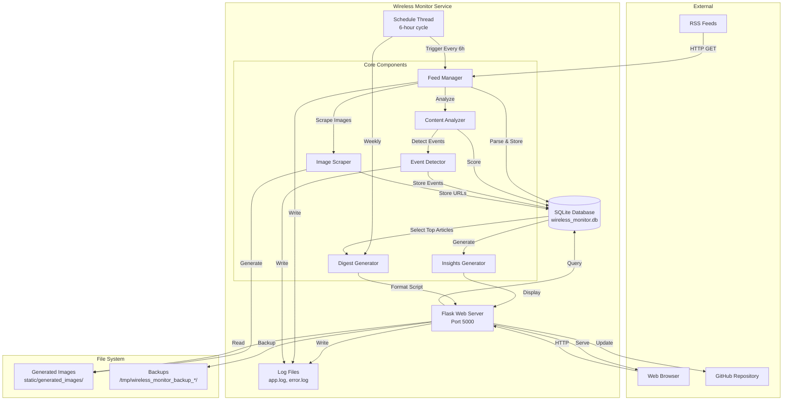
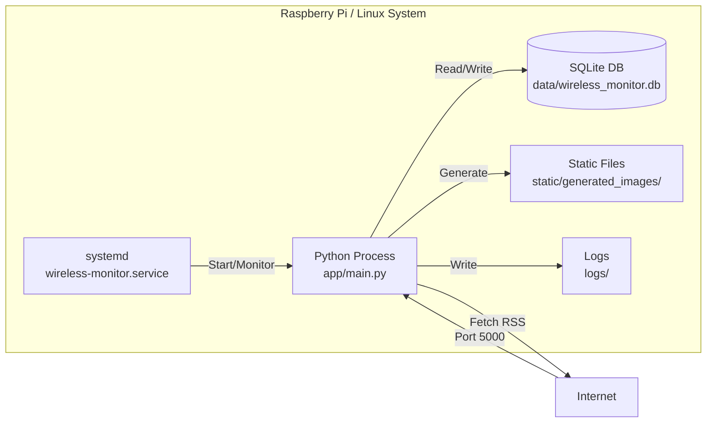
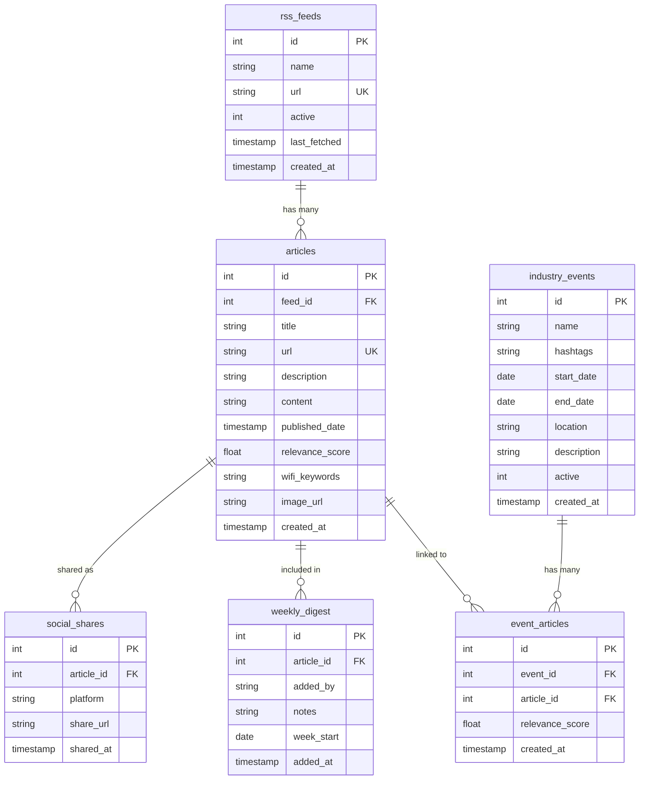

# Design Document: Wireless Monitor System

## Overview

The Wireless Monitor System is a single-service RSS news aggregation platform built with Python Flask and SQLite. The system automatically fetches wireless technology news from configured RSS feeds, analyzes content for relevance using keyword-based scoring, detects industry events, scrapes article images, and provides a clean newspaper-style web interface for consuming news content.

### Key Design Principles

- **Simplicity**: Single Python service with embedded SQLite database
- **Efficiency**: Minimal dependencies, low resource usage (50-80MB RAM)
- **Reliability**: Automatic scheduling, error handling, and graceful degradation
- **Maintainability**: All-in-one architecture with comprehensive logging
- **Performance**: Fast page loads (0.3-0.5s), efficient RSS fetching (8-15s for 10 feeds)

### Technology Stack

- **Backend Framework**: Flask 3.0.0 (Python web framework)
- **Database**: SQLite (embedded, file-based)
- **RSS Parsing**: feedparser 6.0.11
- **Web Scraping**: BeautifulSoup 4.12.2, requests 2.31.0
- **Scheduling**: schedule 1.2.0 (in-process scheduler)
- **Image Processing**: Pillow 10.1.0
- **AI/ML**: diffusers, transformers, torch (optional, for image generation)
- **Service Management**: systemd
- **Template Engine**: Jinja2 (included with Flask)

## Architecture

### System Architecture




### Component Architecture

The system follows a monolithic architecture with a single WirelessMonitor class containing all functionality:

1. **Flask Web Server**: Handles HTTP requests, serves templates, provides REST API
2. **Scheduler Thread**: Runs background tasks (RSS fetching, cleanup, digest generation)
3. **Feed Manager**: Fetches and parses RSS feeds, manages feed subscriptions
4. **Content Analyzer**: Calculates relevance scores using keyword matching
5. **Event Detector**: Identifies industry events from article content
6. **Image Scraper**: Extracts images from articles or generates placeholders
7. **Insights Generator**: Analyzes trends and generates AI insights
8. **Digest Generator**: Creates weekly podcast scripts from top articles

### Deployment Architecture




The system runs as a single systemd service that:
- Starts automatically on boot
- Restarts automatically on failure
- Binds to 0.0.0.0:5000 for network access
- Handles graceful shutdown on SIGTERM/SIGINT

## Components and Interfaces

### 1. WirelessMonitor Class

The main application class that initializes and coordinates all components.

**Initialization**:
```python
def __init__(self):
    - Initialize Flask app
    - Set up database path (data/wireless_monitor.db)
    - Define Wi-Fi keywords for relevance scoring
    - Initialize database schema
    - Set up Flask routes
    - Configure template functions
    - Initialize scheduler
    - Record start time for uptime tracking
```

**Key Attributes**:
- `app`: Flask application instance
- `db_path`: Path to SQLite database file
- `wifi_keywords`: List of wireless technology keywords for scoring
- `start_time`: Timestamp when service started

### 2. Feed Manager

Manages RSS feed subscriptions and fetching operations.

**Interface**:
```python
def fetch_rss_feeds() -> int:
    """
    Fetch all active RSS feeds and store new articles.
    
    Returns:
        Number of new articles fetched
    
    Process:
        1. Query active feeds from database
        2. For each feed:
           - Fetch RSS content via HTTP
           - Parse with feedparser
           - Extract article metadata (title, URL, description, content, date)
           - Check for duplicates by URL
           - Calculate relevance score
           - Extract matched keywords
           - Store article if relevance > 0.05
           - Generate article image automatically
           - Update feed last_fetched timestamp
        3. Update global last_fetch setting
        4. Trigger event analysis if new articles found
        5. Return total new articles count
    """
```

**Database Operations**:
- Read: `SELECT * FROM rss_feeds WHERE active = 1`
- Write: `INSERT INTO articles (...)`
- Update: `UPDATE rss_feeds SET last_fetched = CURRENT_TIMESTAMP`
- Update: `INSERT OR REPLACE INTO settings (key, value) VALUES ('last_fetch', ...)`

### 3. Content Analyzer

Calculates relevance scores for articles based on wireless technology keywords.

**Interface**:
```python
def calculate_relevance_score(text: str) -> float:
    """
    Calculate relevance score (0.0 to 1.0) for article text.
    
    Args:
        text: Combined article title, description, and content (lowercase)
    
    Returns:
        Relevance score between 0.0 and 1.0
    
    Algorithm:
        1. Count keyword matches in text
        2. Calculate keyword density (matches / word_count)
        3. Calculate base score: min(density * 50, 0.8)
        4. Boost for important keywords (wifi, wi-fi, wireless, 5g, 6g)
        5. Importance boost: min(important_matches * 0.1, 0.2)
        6. Final score: min(base_score + importance_boost, 1.0)
    """
```

**Keyword List** (wifi_keywords):
- Core: wifi, wi-fi, wireless, 5g, 6g, cellular, spectrum
- Standards: 802.11, lte, nr, umts, gsm
- Technologies: mimo, beamforming, mesh, roaming, handoff
- Devices: router, access point, modem, antenna, base station
- Protocols: tcp/ip, dhcp, dns, vpn
- Security: wpa, wpa2, wpa3, encryption
- Companies: qualcomm, broadcom, intel, cisco, ericsson, nokia, huawei
- Organizations: fcc, itu, 3gpp, ieee, wi-fi alliance

### 4. Event Detector

Identifies industry events from article content and links related articles.

**Interface**:
```python
def detect_new_events_from_articles(conn: sqlite3.Connection):
    """
    Analyze recent articles to detect new industry events.
    
    Process:
        1. Query articles from last 30 days
        2. Search for event patterns in titles/descriptions:
           - Conference names (CES, MWC, IFA, etc.)
           - Year mentions (2024, 2025)
           - Event keywords (conference, summit, expo, show)
        3. Extract event metadata:
           - Event name
           - Year
           - Estimated dates
           - Location (if mentioned)
        4. Generate hashtags from event name
        5. Check if event already exists
        6. Insert new event into database
        7. Link related articles to event
    """

def estimate_event_dates(event_name: str, year: int) -> dict:
    """
    Estimate start and end dates for known events.
    
    Args:
        event_name: Name of the event
        year: Year of the event
    
    Returns:
        Dictionary with 'start' and 'end' date strings
    
    Known Events:
        - CES: Early January (Jan 5-8)
        - MWC: Late February (Feb 26-29)
        - IFA: Early September (Sep 6-10)
        - NRF: Mid January (Jan 14-16)
        - Default: Current date ± 3 days
    """

def generate_event_hashtags(event_name: str) -> str:
    """
    Generate comma-separated hashtags for an event.
    
    Args:
        event_name: Name of the event
    
    Returns:
        Comma-separated hashtag string
    
    Examples:
        "CES 2024" -> "#CES2024, #CES, #ConsumerElectronics"
        "MWC Barcelona 2024" -> "#MWC2024, #MWC, #MobileWorldCongress, #Barcelona"
    """

def search_and_link_event_articles(conn, event_id, event_name, hashtags):
    """
    Search for articles related to an event and link them.
    
    Args:
        conn: Database connection
        event_id: ID of the event
        event_name: Name of the event
        hashtags: Comma-separated hashtags
    
    Returns:
        Number of articles linked
    
    Process:
        1. Extract keywords from hashtags
        2. Search articles matching keywords
        3. Calculate event relevance score
        4. Link articles with relevance > 0.15
    """
```

### 5. Image Scraper

Extracts images from article URLs or generates placeholder images.

**Interface**:
```python
def scrape_article_image(article_url: str, article_title: str) -> str:
    """
    Scrape image from article URL using multiple strategies.
    
    Args:
        article_url: URL of the article
        article_title: Title of the article
    
    Returns:
        Image URL or None
    
    Strategies (in order):
        1. Open Graph image (og:image meta tag)
        2. Twitter Card image (twitter:image meta tag)
        3. JSON-LD structured data image
        4. Article-specific selectors (figure img, article img)
        5. Content area images (largest in main content)
        6. Any decent image on page (size > 200x200)
        7. External image search by keywords
        8. Generate placeholder image
    """

def validate_image_quality(image_url: str) -> bool:
    """
    Validate image quality by checking dimensions and accessibility.
    
    Args:
        image_url: URL of the image
    
    Returns:
        True if image meets quality standards
    
    Criteria:
        - Image is accessible (HTTP 200)
        - Dimensions >= 200x200 pixels
        - File size > 5KB
        - Not a tracking pixel or icon
        - Valid image format (jpg, png, webp)
    """

def generate_enhanced_pil_image(title, description, image_path, content_hash):
    """
    Generate a custom image for articles without scraped images.
    
    Args:
        title: Article title
        description: Article description
        image_path: Path to save generated image
        content_hash: Hash for caching
    
    Returns:
        Path to generated image
    
    Process:
        1. Determine theme from title (wifi, cellular, ai, tech)
        2. Create 1200x630 image with themed background
        3. Add wireless technology visual elements
        4. Overlay article title with professional typography
        5. Add lighting effects and gradients
        6. Save as PNG file
    """
```

### 6. Flask Routes (Web Interface)

**Public Routes**:
- `GET /`: Home page with top articles
- `GET /feeds`: Feed management page
- `GET /admin`: Admin dashboard
- `GET /events`: Industry events page
- `GET /event/<id>`: Event detail page
- `GET /insights`: AI insights page
- `GET /weekly_digest`: Weekly podcast script
- `GET /wild_wifi`: Wild Wi-Fi stories
- `GET /social_config`: Social media configuration
- `GET /image_gallery`: Gallery of article images

**Feed Management Routes**:
- `POST /add_feed`: Add new RSS feed
- `POST /bulk_import`: Import multiple RSS feeds
- `POST /add_google_news`: Add Google News feed by keyword
- `GET /toggle_feed/<id>`: Toggle feed active status
- `POST /delete_feed/<id>`: Delete feed and articles

**API Routes**:
- `GET /api/status`: Service status and uptime
- `GET /api/fetch_now`: Manually trigger RSS fetch
- `POST /api/update_system`: Update from GitHub
- `POST /api/detect_events`: Manually trigger event detection
- `POST /api/add_manual_event`: Add event manually
- `DELETE /api/remove_event/<id>`: Remove event
- `POST /api/fetch_event_content/<id>`: Fetch event-related content
- `GET /api/system_status`: Real-time system metrics
- `POST /api/clear_generated_images`: Clear all generated images

## Data Models

### Database Schema


```sql
-- RSS Feeds Table
CREATE TABLE rss_feeds (
    id INTEGER PRIMARY KEY AUTOINCREMENT,
    name TEXT NOT NULL,
    url TEXT UNIQUE NOT NULL,
    active INTEGER DEFAULT 1,
    last_fetched TIMESTAMP,
    created_at TIMESTAMP DEFAULT CURRENT_TIMESTAMP
);

-- Articles Table
CREATE TABLE articles (
    id INTEGER PRIMARY KEY AUTOINCREMENT,
    feed_id INTEGER,
    title TEXT NOT NULL,
    url TEXT UNIQUE NOT NULL,
    description TEXT,
    content TEXT,
    published_date TIMESTAMP,
    relevance_score REAL DEFAULT 0,
    entertainment_score REAL DEFAULT 0,
    wifi_keywords TEXT,
    image_url TEXT,
    created_at TIMESTAMP DEFAULT CURRENT_TIMESTAMP,
    FOREIGN KEY (feed_id) REFERENCES rss_feeds (id)
);

-- Industry Events Table
CREATE TABLE industry_events (
    id INTEGER PRIMARY KEY AUTOINCREMENT,
    name TEXT NOT NULL,
    hashtags TEXT,
    start_date DATE,
    end_date DATE,
    location TEXT,
    description TEXT,
    active INTEGER DEFAULT 1,
    created_at TIMESTAMP DEFAULT CURRENT_TIMESTAMP
);

-- Event Articles Junction Table
CREATE TABLE event_articles (
    id INTEGER PRIMARY KEY AUTOINCREMENT,
    event_id INTEGER,
    article_id INTEGER,
    relevance_score REAL DEFAULT 0,
    created_at TIMESTAMP DEFAULT CURRENT_TIMESTAMP,
    FOREIGN KEY (event_id) REFERENCES industry_events (id),
    FOREIGN KEY (article_id) REFERENCES articles (id)
);

-- System Settings Table
CREATE TABLE settings (
    key TEXT PRIMARY KEY,
    value TEXT,
    updated_at TIMESTAMP DEFAULT CURRENT_TIMESTAMP
);

-- Social Media Configuration Table
CREATE TABLE social_config (
    id INTEGER PRIMARY KEY AUTOINCREMENT,
    platform TEXT NOT NULL UNIQUE,
    username TEXT,
    enabled INTEGER DEFAULT 0,
    api_key TEXT,
    api_secret TEXT,
    access_token TEXT,
    created_at TIMESTAMP DEFAULT CURRENT_TIMESTAMP
);

-- Weekly Digest Table
CREATE TABLE weekly_digest (
    id INTEGER PRIMARY KEY AUTOINCREMENT,
    article_id INTEGER,
    added_by TEXT DEFAULT 'user',
    notes TEXT,
    added_at TIMESTAMP DEFAULT CURRENT_TIMESTAMP,
    week_start DATE,
    FOREIGN KEY (article_id) REFERENCES articles (id)
);

-- Wild Wi-Fi Stories Table
CREATE TABLE wild_wifi_stories (
    id INTEGER PRIMARY KEY AUTOINCREMENT,
    title TEXT NOT NULL,
    story TEXT NOT NULL,
    location TEXT,
    source_url TEXT,
    category TEXT DEFAULT 'general',
    humor_rating INTEGER DEFAULT 3,
    tech_relevance TEXT,
    submitted_by TEXT DEFAULT 'system',
    approved INTEGER DEFAULT 1,
    featured INTEGER DEFAULT 0,
    created_at TIMESTAMP DEFAULT CURRENT_TIMESTAMP,
    updated_at TIMESTAMP DEFAULT CURRENT_TIMESTAMP
);

-- Social Shares Table
CREATE TABLE social_shares (
    id INTEGER PRIMARY KEY AUTOINCREMENT,
    article_id INTEGER,
    platform TEXT NOT NULL,
    share_url TEXT,
    shared_at TIMESTAMP DEFAULT CURRENT_TIMESTAMP,
    FOREIGN KEY (article_id) REFERENCES articles (id)
);
```

### Entity Relationships



## Algorithms

### Relevance Scoring Algorithm

**Purpose**: Calculate how relevant an article is to wireless technology.

**Input**: Article text (title + description + content, lowercase)

**Output**: Relevance score (0.0 to 1.0)

**Algorithm**:
```
1. Initialize keyword_matches = 0
2. For each keyword in wifi_keywords:
     If keyword appears in text:
       keyword_matches += 1

3. Calculate word_count = number of words in text
4. If word_count == 0:
     Return 0

5. Calculate keyword_density = keyword_matches / word_count

6. Calculate base_score = min(keyword_density * 50, 0.8)

7. Count important_matches = number of important keywords in text
   Important keywords: ['wifi', 'wi-fi', 'wireless', '5g', '6g']

8. Calculate importance_boost = min(important_matches * 0.1, 0.2)

9. Calculate final_score = min(base_score + importance_boost, 1.0)

10. Return final_score
```

**Example**:
- Text: "New Wi-Fi 6E router with 5G backhaul announced at CES"
- Keywords matched: wifi, wi-fi, 5g, router, ces (5 matches)
- Word count: 10
- Keyword density: 5/10 = 0.5
- Base score: min(0.5 * 50, 0.8) = 0.8
- Important matches: 3 (wi-fi, 5g, wifi)
- Importance boost: min(3 * 0.1, 0.2) = 0.2
- Final score: min(0.8 + 0.2, 1.0) = 1.0

### Event Detection Algorithm

**Purpose**: Automatically detect industry events from article content.

**Input**: Recent articles (last 30 days)

**Output**: New events added to database

**Algorithm**:
```
1. Query articles from last 30 days

2. For each article:
   a. Search title and description for event patterns:
      - Known event names: CES, MWC, IFA, NRF, etc.
      - Year patterns: 2024, 2025, etc.
      - Event keywords: conference, summit, expo, show, event
   
   b. If event pattern found:
      - Extract event name
      - Extract year (or use current year)
      - Estimate event dates based on known schedules
      - Extract location if mentioned
      - Generate hashtags from event name
   
   c. Check if event already exists in database:
      - Query by similar name and year
   
   d. If event doesn't exist:
      - Insert new event record
      - Link current article to event
      - Search for other related articles
      - Link related articles to event

3. Return count of new events detected
```

**Event Date Estimation**:
```
Known event schedules:
- CES: January 5-8
- MWC: February 26-29
- IFA: September 6-10
- NRF: January 14-16

For unknown events:
- Use current date as start
- Set end date 3 days after start
```

### Image Scraping Algorithm

**Purpose**: Extract high-quality images from article URLs.

**Input**: Article URL and title

**Output**: Image URL or None

**Algorithm**:
```
1. Fetch article HTML content

2. Parse HTML with BeautifulSoup

3. Try extraction strategies in order:

   Strategy 1: Open Graph Image
   - Find <meta property="og:image" content="...">
   - Validate image quality
   - If valid, return image URL

   Strategy 2: Twitter Card Image
   - Find <meta name="twitter:image" content="...">
   - Validate image quality
   - If valid, return image URL

   Strategy 3: JSON-LD Structured Data
   - Find <script type="application/ld+json">
   - Parse JSON and extract image field
   - Validate image quality
   - If valid, return image URL

   Strategy 4: Article-Specific Selectors
   - Search for: figure img, article img, .article-image
   - Score images by size and position
   - Select highest-scoring image
   - Validate image quality
   - If valid, return image URL

   Strategy 5: Content Area Analysis
   - Identify main content area
   - Find all images in content area
   - Score by dimensions and context
   - Select best image
   - Validate image quality
   - If valid, return image URL

   Strategy 6: Any Decent Image
   - Find all images on page
   - Filter by minimum size (200x200)
   - Exclude icons, logos, ads
   - Select largest image
   - Validate image quality
   - If valid, return image URL

   Strategy 7: External Image Search
   - Extract keywords from article title
   - Search Unsplash, Pixabay, Pexels
   - Return first valid result

   Strategy 8: Generate Placeholder
   - Create custom image with article title
   - Use wireless technology themed background
   - Return path to generated image

4. If all strategies fail, return None
```

**Image Quality Validation**:
```
1. Send HTTP HEAD request to image URL
2. Check response status (must be 200)
3. Check Content-Type (must be image/*)
4. Download image
5. Check dimensions (must be >= 200x200)
6. Check file size (must be > 5KB)
7. Check aspect ratio (prefer 16:9 or 4:3)
8. Reject if URL contains: pixel, tracking, icon, logo, avatar
9. Return True if all checks pass, False otherwise
```

### Weekly Digest Generation Algorithm

**Purpose**: Generate a podcast script from top weekly articles.

**Input**: Week start date

**Output**: Formatted podcast script

**Algorithm**:
```
1. Calculate week date range (week_start to week_start + 7 days)

2. Query top 10 articles from the week:
   - Filter by published_date in week range
   - Order by relevance_score DESC
   - Limit to 10 articles

3. Generate script structure:

   Introduction:
   - "Welcome to The Wireless Monitor Weekly Digest"
   - "This week in wireless technology: [week dates]"
   - "Here are the top stories..."

   For each article:
   - Article number and title
   - Source and publication date
   - Key points from description
   - Relevance to wireless technology
   - Transition to next article

   Conclusion:
   - Summary of key themes
   - "That's all for this week"
   - "Visit our website for more details"
   - Sign-off

4. Format script with proper spacing and punctuation

5. Store script in database with week_start date

6. Return formatted script
```

## Correctness Properties

*A property is a characteristic or behavior that should hold true across all valid executions of a system—essentially, a formal statement about what the system should do. Properties serve as the bridge between human-readable specifications and machine-verifiable correctness guarantees.*

Before defining the correctness properties, I'll analyze each acceptance criterion for testability:


### Property Reflection

After analyzing all acceptance criteria, I've identified the following testable properties. Here's the reflection to eliminate redundancy:

**Redundancy Analysis**:
- Properties 1.2 (validate and store feed) and 1.7 (reject duplicates) can be combined into one property about feed addition
- Properties 3.3 (store article with fields) and 3.4 (skip duplicates) can be combined into one property about article storage
- Properties 4.1, 4.2, 4.3, 4.7 (various aspects of relevance scoring) can be combined into comprehensive scoring properties
- Properties 12.1, 12.2, 12.3, 12.6, 12.8 (image extraction strategies) can be combined into one property about image availability

**Final Property Set** (after removing redundancy):
1. Feed management (add, delete, toggle, duplicates)
2. Article storage and deduplication
3. Relevance scoring algorithm
4. Event detection and linking
5. Image extraction and fallback
6. Database integrity

### Correctness Properties

Property 1: Feed Addition and Duplicate Prevention
*For any* RSS feed with a valid URL, adding it to the system should result in exactly one feed record in the database, regardless of how many times the same URL is submitted.
**Validates: Requirements 1.2, 1.7**

Property 2: Feed Deletion Cascades to Articles
*For any* RSS feed with associated articles, deleting the feed should remove both the feed record and all articles that reference that feed ID.
**Validates: Requirements 1.3**

Property 3: Active Status Controls Fetch Behavior
*For any* RSS feed, when its active status is set to 0 (inactive), it should not be included in the list of feeds fetched during the next fetch operation.
**Validates: Requirements 1.4**

Property 4: Bulk Import Parses Multiple URLs
*For any* text input containing multiple RSS URLs separated by newlines, the bulk import function should attempt to process each URL independently.
**Validates: Requirements 2.1**

Property 5: Article Storage with Required Fields
*For any* new article discovered from an RSS feed, storing it should create a database record containing title, URL, description, content, published_date, and relevance_score fields.
**Validates: Requirements 3.3**

Property 6: Article URL Uniqueness
*For any* article URL, attempting to store it multiple times should result in exactly one article record in the database.
**Validates: Requirements 3.4**

Property 7: Feed Timestamp Updates After Fetch
*For any* RSS feed that is successfully fetched, the last_fetched timestamp should be updated to reflect the current time.
**Validates: Requirements 3.6**

Property 8: Relevance Score Increases with Keyword Density
*For any* two articles where article A contains more wireless technology keywords than article B, article A should receive a higher or equal relevance score than article B.
**Validates: Requirements 4.1, 4.2**

Property 9: Title and Description Both Analyzed
*For any* article, keywords appearing in either the title or description should contribute to the relevance score calculation.
**Validates: Requirements 4.3**

Property 10: Keyword Matching is Case-Insensitive
*For any* article text, the relevance score should be identical whether keywords appear in uppercase, lowercase, or mixed case.
**Validates: Requirements 4.7**

Property 11: Matched Keywords Are Extracted
*For any* article containing wireless technology keywords, the wifi_keywords field should contain a comma-separated list of the matched keywords.
**Validates: Requirements 4.5**

Property 12: Articles Sorted by Relevance Score
*For any* list of articles displayed on the home page, each article should have a relevance score greater than or equal to the article that follows it.
**Validates: Requirements 4.6**

Property 13: Event Detection Creates Database Records
*For any* article text containing known event patterns (CES, MWC, etc.), the event detection process should create or update an event record in the industry_events table.
**Validates: Requirements 8.1, 8.3**

Property 14: Event Metadata Extraction
*For any* detected event, the event record should contain non-null values for name, hashtags, start_date, and end_date fields.
**Validates: Requirements 8.2**

Property 15: Event Date Estimation for Known Events
*For any* known event name (CES, MWC, IFA, NRF), the estimated start and end dates should match the typical schedule for that event.
**Validates: Requirements 8.5**

Property 16: Articles Linked to Relevant Events
*For any* event and article where the article text contains event hashtags or keywords, the event_articles table should contain a link between them with a relevance score > 0.
**Validates: Requirements 8.4**

Property 17: Event Articles Sorted by Relevance
*For any* event detail page, the articles displayed should be ordered by event_relevance score in descending order.
**Validates: Requirements 8.7**

Property 18: Image Extraction Attempts Multiple Strategies
*For any* article URL, the image scraping process should attempt at least 3 different extraction strategies before falling back to generation.
**Validates: Requirements 12.1, 12.2, 12.3**

Property 19: Image Quality Validation
*For any* image URL, if the image dimensions are less than 200x200 pixels, it should be rejected by the validation process.
**Validates: Requirements 12.4, 12.5**

Property 20: All Articles Have Images
*For any* article in the database, after the image scraping process completes, the article should have a non-null image_url field (either scraped or generated).
**Validates: Requirements 12.6, 12.8**

Property 21: Foreign Key Integrity
*For any* article record, the feed_id must reference an existing feed in the rss_feeds table, or the insert should fail.
**Validates: Requirements 20.3**

Property 22: Automatic Timestamp Assignment
*For any* new record inserted into any table, the created_at field should be automatically populated with the current timestamp.
**Validates: Requirements 20.5**

## Error Handling

### Error Handling Strategy

The system follows a "fail gracefully" approach where errors in one component don't cascade to others:

1. **RSS Fetch Errors**: If one feed fails, continue with remaining feeds
2. **Image Scraping Errors**: If scraping fails, generate placeholder image
3. **Event Detection Errors**: Log error and continue processing
4. **Database Errors**: Log error, rollback transaction, return error response
5. **External API Errors**: Timeout after 30 seconds, log error, continue

### Error Categories

**Network Errors**:
- RSS feed unreachable: Log error, skip feed, continue with others
- Image URL unreachable: Try next extraction strategy
- External API timeout: Log error, use fallback method

**Data Errors**:
- Duplicate URL: Silently skip (expected behavior)
- Invalid URL format: Reject with error message
- Missing required fields: Use default values or skip record

**System Errors**:
- Database locked: Retry up to 3 times with exponential backoff
- Disk full: Log critical error, stop new writes
- Out of memory: Log critical error, restart service (systemd handles)

**User Errors**:
- Invalid input: Display error message, don't process
- Unauthorized access: Return 403 error
- Not found: Return 404 error

### Logging Strategy

**Log Levels**:
- INFO: Normal operations (fetch started, articles added, events detected)
- WARNING: Recoverable errors (image scraping failed, feed timeout)
- ERROR: Unexpected errors (database error, parsing failure)
- CRITICAL: System-level failures (disk full, database corruption)

**Log Files**:
- `logs/app.log`: All application logs (INFO and above)
- `logs/error.log`: Error logs only (ERROR and above)
- Systemd journal: Service lifecycle events

**Log Rotation**:
- Automatic rotation when files exceed 10MB
- Keep last 5 log files
- Compress old logs

## Testing Strategy

### Dual Testing Approach

The system requires both unit tests and property-based tests for comprehensive coverage:

**Unit Tests**: Verify specific examples, edge cases, and error conditions
- Test specific RSS feed parsing scenarios
- Test known event detection patterns
- Test image validation edge cases
- Test database schema initialization
- Test API endpoint responses
- Test error handling paths

**Property-Based Tests**: Verify universal properties across all inputs
- Test relevance scoring algorithm with random article text
- Test feed deduplication with random URLs
- Test article deduplication with random article data
- Test event detection with random event names
- Test image validation with random dimensions
- Test sorting behavior with random relevance scores

### Property-Based Testing Configuration

**Library**: Use `hypothesis` for Python property-based testing

**Test Configuration**:
- Minimum 100 iterations per property test
- Each test tagged with: `# Feature: wireless-monitor-system, Property N: [property text]`
- Use custom generators for domain-specific data (RSS feeds, articles, events)

**Example Property Test Structure**:
```python
from hypothesis import given, strategies as st
import hypothesis

@given(
    article_text=st.text(min_size=10, max_size=1000),
    keyword_count=st.integers(min_value=0, max_value=20)
)
@hypothesis.settings(max_examples=100)
def test_relevance_score_increases_with_keywords():
    # Feature: wireless-monitor-system, Property 8: Relevance Score Increases with Keyword Density
    # Test that more keywords result in higher scores
    pass
```

### Test Coverage Goals

- Unit test coverage: 80% of code lines
- Property test coverage: All 22 correctness properties
- Integration test coverage: All API endpoints
- End-to-end test coverage: Critical user flows (add feed, fetch articles, view events)

### Testing Priorities

**High Priority** (must test):
1. Relevance scoring algorithm (Properties 8-12)
2. Feed and article deduplication (Properties 1, 6)
3. Event detection and linking (Properties 13-17)
4. Database integrity (Properties 21-22)

**Medium Priority** (should test):
5. Image scraping and validation (Properties 18-20)
6. Feed management operations (Properties 2-4)
7. Article storage (Properties 5, 7)

**Low Priority** (nice to test):
8. UI rendering and display
9. Logging and error messages
10. Performance characteristics

### Manual Testing

**System Integration Testing**:
- Install on fresh Raspberry Pi
- Verify automatic startup
- Test RSS fetching cycle
- Verify web interface accessibility
- Test system update mechanism
- Test system reset with backup

**User Acceptance Testing**:
- Add and remove feeds through UI
- Verify article relevance scores
- Check event detection accuracy
- Validate image quality
- Test weekly digest generation
- Verify social media configuration

## Deployment Considerations

### Installation Process

1. Clone repository to ~/wireless_monitor
2. Install Python dependencies from requirements.txt
3. Create data and logs directories
4. Initialize SQLite database with schema
5. Install systemd service file
6. Enable and start service
7. Verify service is running on port 5000

### System Requirements

- **OS**: Linux (Raspberry Pi OS, Ubuntu, Debian)
- **Python**: 3.7 or higher
- **RAM**: 512MB minimum, 1GB recommended
- **Storage**: 100MB for application + data
- **Network**: Internet connection for RSS feeds

### Configuration

**Environment Variables**:
- `USER`: Current user (default: wifi)
- `PORT`: Web server port (default: 5000)

**Configuration Files**:
- `wireless-monitor.service`: Systemd service configuration
- `requirements.txt`: Python dependencies
- `data/wireless_monitor.db`: SQLite database

### Monitoring

**Health Checks**:
- HTTP GET /api/status returns service status
- Systemd status shows service health
- Log files show recent activity

**Metrics**:
- Total articles in database
- Active feeds count
- Last fetch timestamp
- System uptime
- Memory usage (via psutil)
- CPU usage (via psutil)

### Backup and Recovery

**Automatic Backup**:
- System reset creates timestamped backup in /tmp
- Backup includes database and configuration

**Manual Backup**:
```bash
cp data/wireless_monitor.db ~/backup/wireless_monitor_$(date +%Y%m%d).db
```

**Recovery**:
```bash
cp ~/backup/wireless_monitor_YYYYMMDD.db data/wireless_monitor.db
sudo systemctl restart wireless-monitor
```

### Update Process

**Automatic Update** (via admin panel):
1. Stash local changes
2. Pull latest code from GitHub
3. Restore local changes if possible
4. Restart service

**Manual Update**:
```bash
cd ~/wireless_monitor
git pull origin main
sudo systemctl restart wireless-monitor
```

### Security Considerations

**Network Security**:
- Service binds to 0.0.0.0 (all interfaces)
- No authentication required (intended for local network use)
- Consider firewall rules for production deployment

**Data Security**:
- SQLite database stored locally
- No encryption at rest
- Social media credentials stored in plaintext (consider encryption for production)

**Input Validation**:
- URL format validation for RSS feeds
- SQL injection prevention via parameterized queries
- XSS prevention via Jinja2 auto-escaping

### Performance Optimization

**Database Optimization**:
- Index on articles.url for duplicate checking
- Index on articles.relevance_score for sorting
- Index on articles.published_date for date filtering
- Regular VACUUM to reclaim space

**Caching Strategy**:
- Generated images cached on disk
- No in-memory caching (to minimize RAM usage)

**Resource Limits**:
- Limit RSS fetch to 20 most recent articles per feed
- Limit article display to 50 on home page
- Limit event article display to 50 per event
- 30-day automatic cleanup of old articles

## Future Enhancements

This documentation spec captures the existing system. Potential future enhancements include:

1. **Authentication and Authorization**: Add user accounts and role-based access
2. **Real-time Updates**: WebSocket support for live article updates
3. **Advanced Search**: Full-text search across articles
4. **Export Functionality**: Export articles to PDF, EPUB, or RSS
5. **Mobile App**: Native mobile applications for iOS and Android
6. **Multi-language Support**: Internationalization and localization
7. **Advanced Analytics**: Trend analysis, sentiment analysis, topic modeling
8. **Social Media Integration**: Automatic posting to configured platforms
9. **Email Notifications**: Daily or weekly email digests
10. **API Documentation**: OpenAPI/Swagger documentation for REST API
